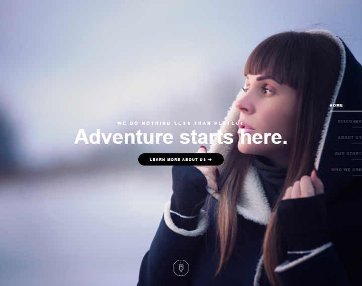

# Bespoke One Page Creative HTML Template Clone

This is a clone of [Bespoke One Page Creative HTML Template](https://elements.envato.com/bespoke-one-page-creative-html-template-CKCPVH). Since I liked it design, I used it to practice Tailwind.css.

## Table of contents

- [Overview](#overview)
  - [The challenge](#the-challenge)
  - [Screenshot](#screenshot)
  - [Links](#links)
- [My process](#my-process)
  - [Built with](#built-with)
  - [Useful resources](#useful-resources)
- [Author](#author)

## Overview

### The challenge

Creating a clone as similar as original [demo page](http://nasfactor.com/themes/bespoke/main/index3.html).

### Screenshot

(These sceenshots are only for preview, visit demo link to see all features.)

 </img>
 </img>

### Links

- Solution URL: [Github Repo](https://github.com/ranker-M/ranker-M.github.io/tree/main/Bespoke%20Landing%20Page)
- Live Site URL: [Live Demo](https://ranker-m.github.io/Bespoke%20Landing%20Page/public/)

## My process

### Built with

- Semantic HTML5 markup
- CSS custom properties
- Mobile-first workflow
- [Tailwind](https://tailwindcss.com) - Css framework

### Useful resources

- [Google Fonts](https://fonts.google.com/specimen/Rubik?query=rubik) - Similar font family that used in the original template.
- [Font Awesome](https://fontawesome.com/icons) - Social media icons.
- [Unicode Table](https://unicode-table.com/) - Little icons and symbols that can be used without importing anything.

## Author

- Linkedin - [Meriç Gündüz](https://www.linkedin.com/in/meriç-gündüz-198a99186/)
- Frontend Mentor - [@ranker-M](https://www.frontendmentor.io/profile/ranker-M)
- Github -[@ranker-M](https://github.com/ranker-M)
