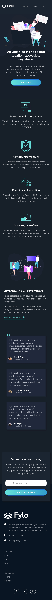
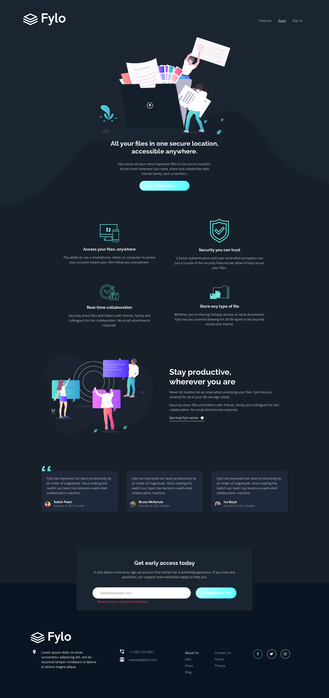

# Frontend Mentor - Fylo dark theme landing page solution

This is a solution to the [Fylo dark theme landing page challenge on Frontend Mentor](https://www.frontendmentor.io/challenges/fylo-dark-theme-landing-page-5ca5f2d21e82137ec91a50fd). Frontend Mentor challenges help you improve your coding skills by building realistic projects.

## Table of contents

- [Overview](#overview)
  - [The challenge](#the-challenge)
  - [Screenshot](#screenshot)
  - [Links](#links)
- [My process](#my-process)
  - [Built with](#built-with)
  - [What I learned](#what-i-learned)
  - [Continued development](#continued-development)
- [Author](#author)

## Overview

### The challenge

Your challenge is to build out this landing page and get it looking as close to the design as possible.

Users should be able to:

- View the optimal layout for the site depending on their device's screen size
- See hover states for all interactive elements on the page

### Screenshot

 </img>
 </img>
 </img>

### Links

- Solution URL: [Github Repo](https://github.com/ranker-M/ranker-M.github.io/tree/main/fylo-dark-theme-landing-page)
- Live Site URL: [Live Demo](https://ranker-m.github.io/fylo-dark-theme-landing-page/)

## My process

### Built with

- Semantic HTML5 markup
- CSS custom properties
- Mobile-first workflow
- [Bootstrap](https://getbootstrap.com) - Css framework
- [Sass](https://sass-lang.com/) - Css Preprocesser
- [Figma](https://www.figma.com) - interface design tool

### What I learned

After creating two projects with using only Scss, I realized that frameworks really lift the heavy work while developing mobile-first web pages. I had much less things to worry abbout while creating mobile or desktop version of the page. It was much easier and faster to create general shape of the page and there were much less error or misplacement to handle after creating first design. I was also able to customize components whenever I want and it was not very complicated. When used correctly, frameworks really help to build web pages more quickly and accurately. It was also easier to make the transaction between mobile and desktop design while using Bootstrap. There are still plenty of things to make manually but most of the thing can be handled with just Bootstrap. I think Bootstrap is really good tool to create simple designed websites. I learned how and why frameworks are powerfull with this project.

### Continued development

I think I am still lacking in pure css and I should create more complicated components via css. I still sometimes struggle to use declerations correctly and I cannot find the optimal solution for the problem I faced. Nevertheless, I am still learning and using frameworks really help me to focus deeper to design rather than coding. And since it is much easier to shape the web page, I can see the result much faster. Sass and Bootstrap almost give me everything I need to make a web page. I will experience more css frameworks from now on and see the best one which fits my needs for the projects I work. Also, I will be aware of scss file structure since it become really bad when not organised properly. And I will try to customize Bootstrap variables by using Sass for one of the project I will work. It may be much easier to create the page that way.

## Author

- Linkedin - [Meriç Gündüz](https://www.linkedin.com/in/meriç-gündüz-198a99186/)
- Frontend Mentor - [@ranker-M](https://www.frontendmentor.io/profile/ranker-M)
- Github -[@ranker-M](https://github.com/ranker-M)
